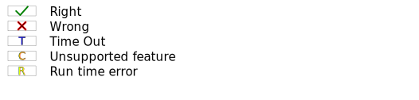

# MpiCorrectnessBenchmark

Source code and CI of the MPI Correctness Benchmark.

## Result
  
Every figure in this section uses those notations :

  
First figure links to the job logs, second to the C source code.

### Parcoach Results
 

### Simgrid Results

